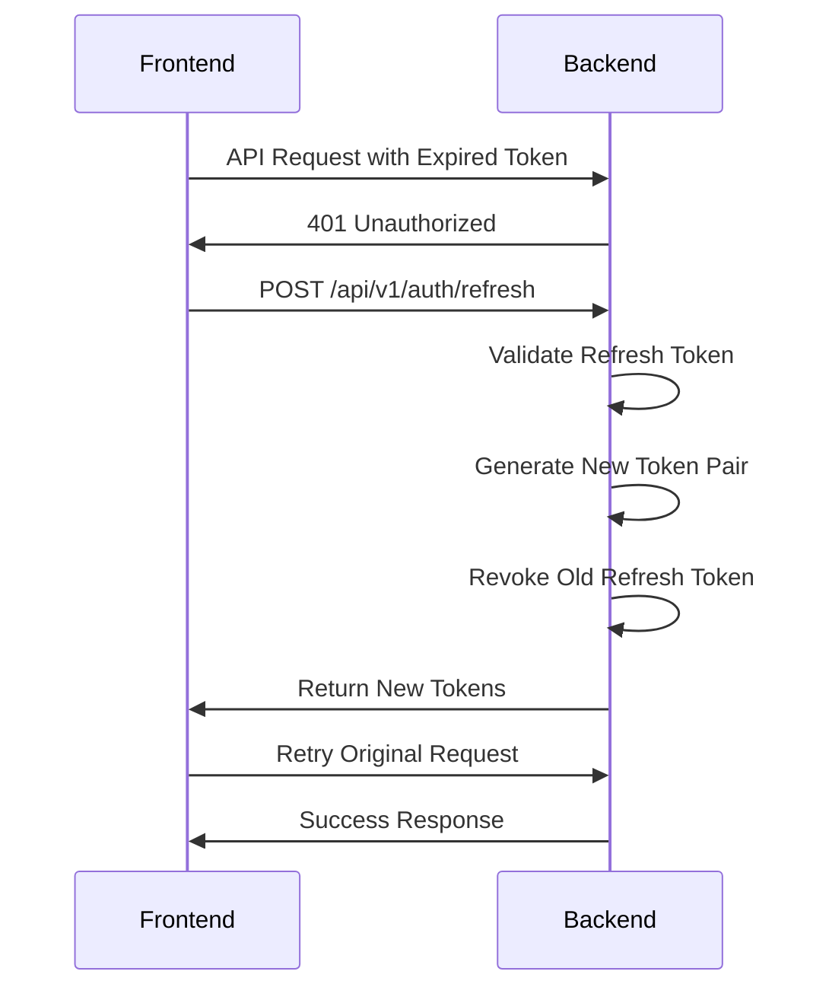

#### Backend Setup
```bash
cd rotate-token-demo
go mod tidy
go run main.go

#### Frontend Setup
```bash
cd frontend
npm install
npm run dev

# Frontend will start on http://localhost:3000
```

## Demo Credentials

Use these credentials to explore the application:

```
Username: demo
Password: password123
```

Or create a new account using the registration form.

### 2. **Token Refresh Flow**
